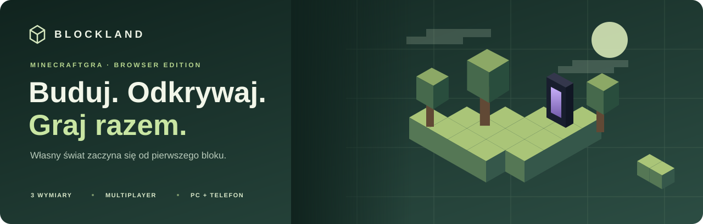

<p align="center">
  
</p>

# MINECRAFTGRA · BLOCKLAND

**Blokowy świat do odkrywania, budowania i wspólnej gry — bez instalowania klienta.** Gra 3D w przeglądarce z trybem przetrwania, craftingiem, trzema wymiarami, smokiem, edytorem postaci i multiplayerem. Na komputerze sterujesz myszą i klawiaturą, a na telefonie przyciskami dotykowymi.

### [▶ Zagraj teraz — minecraftgra.vercel.app](https://minecraftgra.vercel.app)

Wybierz **Tryb wieloosobowy**, wpisz nick i zaproś znajomych pod ten sam adres. Publiczne wdrożenie korzysta z **Vercel Hobby** i istniejącej bazy **Redis Cloud Free 30 MB**. Zmiany wysłane do gałęzi `main` są automatycznie wdrażane.

[Pierwsze kroki](#pierwsze-kroki) · [Trudność i Horror](#poziom-trudności-i-horror) · [Sterowanie](#sterowanie) · [Multiplayer i rozmowy](#multiplayer-i-rozmowy) · [Uruchomienie lokalne](#uruchomienie-lokalne) · [Wdrożenie na Vercelu](docs/DEPLOYMENT.md)

## Co znajdziesz w grze

| Odkrywaj | Buduj | Graj razem |
|---|---|---|
| Proceduralne biomy, jaskinie i struktury | Wydobywanie surowców i różne rodzaje narzędzi | Jeden publiczny świat i własne nicki |
| Nadziemie, Nether i End ze smokiem | Crafting 2 × 2 oraz stół 3 × 3 | Wspólne budowanie i skrzynie |
| Animowane moby, pogoda i cykl dnia | Plecak, hotbar i skrzynie z osobnymi polami | PvP, tarcze, łuki i wytrzymałość |
| Woda, pływanie i podwodny widok | Edytor skórek z dwiema warstwami i peleryną | Czat tekstowy oraz rozmowy przez mikrofon |

Pięć stylów shaderów oraz opcja **Wyłączone** (bez efektów postprocessingu i cieni), ustawienia światła, zasięgu widzenia, dźwięków i muzyki pozwalają dopasować grę do sprzętu. Kamera ma widok z pierwszej osoby, zza pleców i z przodu. Edytor skórki jest domyślnie otwarty po prawej stronie menu: wybierz gotową skórkę albo narysuj własną, obracając model przy wciśniętym środkowym przycisku myszy.

Broń, podstawowe narzędzia, tarcza, łuk i bloki mają modele 3D widoczne przy nadgarstku także po naciśnięciu **F5**, u innych graczy oraz w podglądzie ekwipunku. Sprzęt podąża za animacją ręki. Uderzenie trwa 0,23 s we wszystkich widokach, a czas odnowienia pozostaje zależny od broni. W pierwszej osobie ramię jest zakotwiczone poniżej kadru, a uderzenie prowadzi dłoń w przód i w dół. Domyślna skórka ma rękawy na górze ramion i odsłoniętą szyję; własnoręcznie edytowane skórki pozostają zachowane.

Potwory mają rozbudowane modele: zombie z poszarpanym ubraniem i dłońmi, szkielety z żebrami, szczęką i łukiem, uzbrojone Pigliny, segmentowane macki Ghastów i ruchome pierścienie Płomyków. Zamach potworów prowadzi ręce w górę, następnie do przodu i w dół; trafienie następuje w chwili kontaktu, po której wracają do pozy spoczynkowej. W multiplayer widać również napinanie łuku szkieletu.

Endermany są neutralne do chwili uderzenia lub spojrzenia prosto w oczy. Spojrzenie w nogi, tułów albo przez pełną ścianę ich nie prowokuje. W multiplayerze ścigają osobę, która je sprowokowała; bliżej stojący kolega nie przejmuje automatycznie agresji. Po sprowokowaniu trzeba walczyć lub uciekać, aż agresja wygaśnie.

Podczas kopania odrywają się drobinki z uderzanej powierzchni, a zniszczenie bloku rozrzuca większe odłamki. Drewno, liście, szkło i świecące materiały dają różne fragmenty, które opadają i odbijają się od podłoża. Efekt korzysta ze stałej puli i przełącznika **Cząsteczki** w ustawieniach grafiki.

Otwarcie skrzyni, pieca, craftingu, ekwipunku lub czatu uwalnia kursor, ale postać nadal kończy skok i spada na ziemię. Pod wodą nadal zużywa tlen, a upadek i lawa pozostają niebezpieczne. **Esc** w pojedynczym świecie wstrzymuje grę; w multiplayer otwarte menu nie zatrzymuje fizyki Twojej postaci.

Kaktusy mają wystające kolce i węższy zielony korpus. Dotknięcie kolców bokiem lub wejście na ich szczyt zadaje obrażenia; samo przebywanie w pobliżu jest bezpieczne. Trafienia mają przerwę 0,8 s i uwzględniają trudność oraz pancerz. W multiplayer kontakt sprawdza serwer, również przy otwartym ekwipunku.

## Pierwsze kroki

Menu startowe zachowuje podgląd świata i edytor postaci. Przewiń niżej, aby obejrzeć trzy wymiary, poznać budowanie i wspólną grę oraz przymierzyć kolory postaci. Przyciski prowadzą bezpośrednio do gry i jej ustawień. Podgląd 3D świata i edytora przestaje renderować, gdy górna część menu znika z ekranu; animacje strony uwzględniają systemowe ograniczenie ruchu.

1. Wybierz **Tryb i trudność**, a następnie tryb przetrwania lub dołącz do świata wieloosobowego. Nowa postać zaczyna z pustym ekwipunkiem.
2. Przytrzymaj LPM na drewnie, zbierz surowiec i otwórz ekwipunek klawiszem **E**. Postępujące pęknięcia bloku pokazują pracę narzędzia.
3. Zajrzyj do **Księgi receptur**. Przygotuj deski, a następnie stół rzemieślniczy z czterech desek. Własna siatka ma 2 × 2 pola; użycie postawionego stołu otwiera siatkę 3 × 3.
4. Wytwórz narzędzia, przygotuj schronienie i skrzynię. Kilof przyspiesza kopanie kamienia, siekiera drewna, a łopata ziemi, piasku i żwiru.
5. Otwórz **Atlas** klawiszem **J** i odkrywaj świat. Ruiny portali wymagają przygotowania, zanim zabiorą Cię do kolejnego wymiaru.

**Kontynuuj zapisany świat** odtwarza wcześniejszy ekwipunek. Puste pola dotyczą nowej postaci i odrodzenia. W trybie kreatywnym przedmioty wybierasz z katalogu dostępnego w ekwipunku. Puste pole na pasku podręcznym oznacza pustą rękę.

### Schody, półbloki, łóżka i zamki

**Schody dębowe i kamienne** obracają się zgodnie z kierunkiem patrzenia. Kliknięcie górnej połowy bocznej powierzchni albo spodu bloku stawia odwrócone schody lub górny półblok. Dwie połówki tego samego materiału łączą się w pełny blok; po wydobyciu odzyskasz dwa półbloki. Po stopniach wchodzi się płynnie bez skakania, a obrys, pęknięcia i trafienia kursorem odpowiadają ich kształtowi. W księdze receptur znajdziesz oba materiały: trzy deski lub kamienie w rzędzie dają sześć półbloków, a sześć w układzie schodków — cztery schody.

**Łóżko** jest niskie, ma białą poduszkę, czerwony koc i drewniane nogi oraz zajmuje dwa sąsiednie pola. Przy stawianiu obie części potrzebują miejsca i podparcia. Zniszczenie dowolnej połowy usuwa całe łóżko i daje jeden przedmiot. Kliknij je w Nadziemiu, aby ustawić odrodzenie i fizycznie się położyć. Po 10 sekundach nieprzerwanego leżenia podczas nocy zaczyna się dzień. Wstań klawiszem kucania (domyślnie **Shift**) lub przyciskiem **Wstań**, także na telefonie; wcześniejsze wyjście anuluje odliczanie. Możesz odpoczywać również za dnia. W multiplayer inni widzą leżącą postać, a jedno zajęte łóżko wystarcza, aby po 10 sekundach nadeszło wspólne rano. Atak, zniszczenie łóżka lub opuszczenie świata kończy odpoczynek. Skrzynia ma oddzielną pokrywę, boki i tył z zawiasami; zamek znajduje się tylko na przedniej ścianie.

Wyprawy prowadzą również do **zamków o podstawie 73 × 73 bloki** i zrujnowanych twierdz. Za murami są wieże, dziedziniec, wielopiętrowy donżon, koszary, zbrojownia i skarbiec. Rycerze patrolują teren, atakują po wejściu w ich zasięg i wracają do obrony zamku po dłuższym pościgu. Pokonani obrońcy pozostają pokonani po zapisaniu świata. W atlasie (**J**) wybierz **Znajdź zamek**, aby otrzymać cel wyprawy; tryb kreatywny pozwala też od razu go odwiedzić. Zamki, obrońcy, łupy i nowe kształty działają w jednym wspólnym świecie multiplayer.

### Rudy, surowce i zbroje

Pod ziemią znajdziesz węgiel, żelazo, miedź, diamenty oraz nowe złoża złota, czerwonego kamienia, lapis lazuli i szmaragdów. Głębsze warstwy sprzyjają złotu i czerwonym minerałom. W Netherze występują kwarc, złoto i rzadkie pradawne zgliszcza. Skórę pozyskasz z krów. Każda ruda ma odrębną teksturę, a surowce własne ikony.

Rudę żelaza i złota przetop w piecu. Ze zgliszczy otrzymasz złom netherytowy; cztery sztuki złomu i cztery sztabki złota tworzą sztabkę netherytu. Księga receptur pokazuje narzędzia, zbroje i bloki magazynowe. Bloki większości minerałów mieszczą dziewięć sztuk surowca i można je z powrotem rozłożyć; kwarc służy również do budowania.

Pancerz ma **cztery osobne pola: hełm, napierśnik, spodnie i buty**. Załóż część pasującą do pola albo użyj szybkiego przenoszenia. Wyposażenie jest widoczne w podglądzie, po F5 i u pozostałych graczy. Założone części nie zajmują pól plecaka, zapisują się z postacią i wypadają po śmierci.

| Pełny zestaw | Punkty pancerza | Redukcja obrażeń objętych pancerzem |
|---|---:|---:|
| Skóra | 7 / 20 | 28% |
| Złoto | 11 / 20 | 44% |
| Żelazo | 15 / 20 | 60% |
| Diament | 20 / 20 | 80% |

Możesz mieszać materiały. Pancerz chroni m.in. przed trafieniami i ogniem, ale nie przed upadkiem, utonięciem, głodem, pustką ani schwytaniem przez Gościa. W multiplayer serwer sprawdza posiadanie części i przeniesienie przedmiotu, więc założenie zbroi nie tworzy jej kopii.

Złote i diamentowe narzędzia mają własne receptury i parametry. Złoto kopie bardzo szybko, ale złoty kilof ma niski poziom zbierania rud; do diamentów potrzebujesz żelaznego lub diamentowego kilofa, a do obsydianu i pradawnych zgliszczy — diamentowego. Netheryt w tej wersji jest surowcem i blokiem magazynowym; zestawy pancerza kończą się na diamencie.

### Portal do Netheru i walka w Endzie

Obsydianowa ruina stoi blisko spawnu przy **X −18, Z 12**, około 28 bloków od punktu startowego. Nadal wymaga uzupełnienia ramy i zapalenia krzesiwem. Obsydian możesz wytworzyć przez skierowanie wody na źródło lawy; możesz też odlewać elementy ramy na miejscu bez wydobywania ich kilofem. Woda styczna do lawy od góry lub boku zamienia źródło w obsydian. W tej wersji lawa występuje jako nierozlewające się źródła.

Smok ma **600 punktów życia**. Kryształy przyspieszają jego regenerację, więc najpierw je zniszcz. Smok wykonuje częstsze przeloty i wystrzeliwuje podwójne salwy; poniżej połowy zdrowia przechodzi w **furię**, przyspiesza i strzela trzema silniejszymi pociskami. Unikaj salw ruchem w bok i korzystaj z osłon. W multiplayer smok zmienia cele między uczestnikami walki; wszyscy walczą z tym samym smokiem. Starszy zapis zachowuje proporcję pozostałego zdrowia przy zwiększeniu jego puli; pokonany smok nie zostaje wskrzeszony.

Na pierwszą próbę przygotuj pełną diamentową zbroję, miecz, łuk, kilka stosów strzał, jedzenie i bloki. Celując w kryształy z ziemi, odsuń się od wieży i kieruj strzałę ponad szczyt filaru — obsydian zatrzymuje pociski. Dwa stosy strzał mogą nie wystarczyć przy wielu chybieniach; zapas czterech–pięciu stosów daje więcej prób. Najpierw usuń kryształy, potem strzelaj z wyprzedzeniem w nadlatującego smoka i wykorzystuj jego niskie przeloty.

## Poziom trudności i Horror

Wybierz trudność podczas tworzenia świata lub dołączania do multiplayer. W trakcie gry możesz ją zmienić w **Ustawienia → Świat**.

| Poziom | Rozgrywka |
|---|---|
| **Łatwy** (`easy`) | Łagodniejsze obrażenia od otoczenia, wolniejszy głód i szybsza regeneracja |
| **Średni** (`normal`) | Domyślne przetrwanie: zbieranie zapasów, budowanie i eksploracja |
| **Trudny** (`hard`) | Mocniejsze zagrożenia, szybszy głód i wolniejszy powrót do zdrowia |
| **Horror** (`horror`) | Wymagające przetrwanie z narastającą historią spotkań z Gościem |

**Średni jest ustawieniem domyślnym**, także dla starych światów i profili bez zapisanego poziomu trudności. W multiplayer trudność dotyczy **Twojej postaci**. Nadal wszyscy gracie w jednym publicznym świecie; wybór poziomu nie tworzy oddzielnego serwera, a zasady PvP pozostają równe.

### Gość — tylko dla chętnych

Horror włączasz samodzielnie, wybierając ten poziom. Autorska postać **Gościa** buduje napięcie stopniowo: nie od razu zobaczysz wszystko, a po mocniejszych spotkaniach przychodzą spokojniejsze chwile. Historia rozwija się podczas rozgrywki, więc daj jej czas i obserwuj otoczenie. Model postaci i dźwięki powstają proceduralnie — gra nie wymaga instalacji dodatkowych modeli ani paczek audio.

**Gracze na Łatwym, Średnim i Trudnym nie widzą Gościa ani nie słyszą jego dźwięków.** Osoby, które wybrały Horror, mogą przeżywać wspólne spotkania. Możecie jednocześnie budować i rozmawiać z graczami, którzy pozostali przy zwykłym przetrwaniu.

W **Ustawienia → Dźwięk** są osobne opcje **Gość — dźwięki horroru** (`horrorVolume`) i **Nagłe straszenia w trybie Horror** (`horrorJumpscares`). Możesz zmniejszyć głośność lub wyłączyć nagłe zbliżenie i krzyk. Wyłączenie efektu jumpscare nie wyłącza polowania ani śmierci po schwytaniu; zmiana trudności z Horror usuwa całe zagrożenie. Przełączenie trudności z Horror na inny poziom wyłącza udział Twojej postaci w tych zdarzeniach.

### Polowanie Gościa

Odległe ślady obecności stopniowo przechodzą w prawdziwe zagrożenie. Między głównymi zdarzeniami Gość potrafi stać nieruchomo daleko w zamgleniu: cicha, rozmyta sylwetka znika po skupieniu na niej wzroku. Te obserwacje nie zadają obrażeń. Przed polowaniem dostajesz czas na reakcję. Gość obserwuje, zmienia pozycję, próbuje zajść Cię z boku i zapowiada skok krótkim bezruchem. Nie przenika przez ściany; niskie przejścia oraz zerwanie linii wzroku pozwalają zyskać dystans.

Najbezpieczniej jest **uciec**. Przed skokiem odsuń się z jego drogi; po chybieniu wykorzystaj chwilę jego słabości. Możesz też podjąć trudny pojedynek: Gość ma dużo zdrowia, poza oknem odsłonięcia otrzymuje mniejsze obrażenia, a broń zachowuje własny zasięg i czas odnowienia. Działają również strzały. Gracze, którzy wybrali Horror, mogą pomóc sobie podczas wspólnego polowania.

**Schwytanie uruchamia krótki jumpscare, po którym postać umiera i upuszcza wyposażenie zgodnie ze zwykłymi zasadami.** To skutek dosięgnięcia przez Gościa, nie nieunikniona śmierć od samego upływu czasu. Po udanej ucieczce lub pokonaniu Gościa przychodzi okres spokoju. Inne poziomy trudności pozostają wolne od tego zagrożenia.

Nagłemu zbliżeniu towarzyszy autorski krzyk z narastającą, drżącą wysokością głosu i chropowatym wybrzmieniem. Dźwięk jest zsynchronizowany z obrazem także przy opóźnieniu sieci i respektuje głośność horroru oraz wyłączenie jumpscare.

Podczas 1,3-sekundowego schwytania sterowanie ofiary jest zablokowane. Po zakończeniu pojawia się ekran śmierci z działającym kursorem, a odrodzenie przywraca sterowanie. Towarzysze mogą nadal się poruszać. Nagłe zbliżenie maski, szczęki i dłoni oraz warstwowe dźwięki tworzą efekt inspirowany rytmem straszenia FNAF, z własną postacią i własnymi dźwiękami.

## Sterowanie

Wydobywanie zależy od twardości bloku i narzędzia. Kwiaty zrywa pojedynczy klik; kilofy służą do skał i rud, siekiery do drewna, łopaty do ziemi, a motyka i nożyce do roślin. Żelazny kilof łączy kamienny z diamentowym w rozwoju wyposażenia. Pełne zestawienie wszystkich bloków i narzędzi: **[czasy wydobywania i wymagania surowców](docs/MINING.md)**.

| Klawisz / przycisk | Działanie |
|---|---|
| **W A S D** + mysz | Ruch i rozglądanie |
| **Spacja** | Skok / pływanie w górę / wyjście na niski brzeg |
| **2× W** lub lewy **Ctrl** | Sprint |
| **Shift** | Kucanie / wstanie z łóżka |
| **LPM** | Kopanie / atak |
| **PPM** | Postawienie bloku / użycie / osłona tarczą; przytrzymaj 1,6 s, aby zjeść |
| **1–9** lub kółko myszy | Wybór pola podręcznego |
| **E** | Ekwipunek |
| **J / M / H** | Atlas / wymiary / pomoc |
| **Q / Ctrl + Q** | Wyrzuć jedną sztukę / cały stos |
| **R** | Przytrzymaj 1,6 s, aby zjeść przedmiot z dłoni |
| **F** | Przełącz latanie w trybie kreatywnym |
| **F5** | Pierwsza osoba → zza pleców → z przodu |
| **Enter / T** | Czat tekstowy |
| **V** | Domyślny klawisz mikrofonu |
| **Escape** | Zamknij panel / menu pauzy |

Klawisze możesz zmienić w ustawieniach. **E, J, M i H ponownie zamykają swój panel**, jeśli nie wpisujesz tekstu w polu wyszukiwania. Po powrocie gra przejmuje kursor; gdy przeglądarka wymaga dodatkowego kliknięcia, użyj **Wróć do sterowania** albo kliknij w świat.

Aby jeść, wybierz jabłko lub chleb i przytrzymaj **PPM** albo **R** przez **1,6 s**. Ręka unosi jedzenie do ust; kolejnym kęsom towarzyszą dźwięki i okruszki, widoczne także po F5 oraz u innych graczy. Puszczenie przycisku, zmiana pola lub otwarcie panelu przerywa czynność bez zużycia jedzenia. Jeden przedmiot przywraca **6 punktów sytości**, do maksimum 20; zdrowie odzyskujesz później przez zwykłą regenerację. Przy pełnej sytości jedzenie nie jest zużywane. W multiplayer czas i odjęcie przedmiotu zatwierdza serwer.

Przy powierzchni wody **przytrzymaj Spację i płyń w stronę niskiego brzegu**. Postać odbije się w górę i może wyjść na blok, półblok albo schody, jeśli ma miejsce nad głową. Ten ruch nie pozwala wspinać się po wysokiej ścianie ani przenikać przez sufit. Na telefonie użyj joysticka i przycisku skoku.

PPM w grze i jej panelach nie otwiera menu przeglądarki. Sterowanie filtruje nieaktualne ruchy po przechwyceniu kursora i nagłe skoki danych wejściowych; komputer z ekranem dotykowym nadal obsługuje mysz. Obrażenia od mobów i pocisków uwzględniają ściany, a zderzenia pionowe mierzą faktyczny upadek. Krótki komunikat po otrzymaniu obrażeń pomaga rozpoznać ich przyczynę.

### Ekwipunek, crafting, skrzynie i piec

Plecak ma **27 pól**, hotbar **9**, a każda skrzynia **27**. Przedmioty można kłaść w dowolnych polach; skrzynia pokazuje liczbę wolnych miejsc.

| Gest | Działanie |
|---|---|
| Przeciągnij stos | Przenieś go między polami, plecakiem, skrzynią lub siatką craftingu |
| Kliknij stos, potem pole | Podnieś i odłóż; ten sposób również działa |
| **Podwójny LPM** na przedmiocie | Zbierz pasujące przedmioty do stosu trzymanego kursorem |
| **PPM** | Podnieś połowę stosu albo odłóż jedną sztukę |
| Trzymany stos + przeciąganie **LPM / PPM** | Rozdziel równo / odłóż po jednej sztuce w odwiedzonych polach |
| **Shift + wynik craftingu** | Wytwórz serię do limitu stosu i dostępnego miejsca |
| **Shift + klik** | Szybko przenieś stos między obszarami ekwipunku lub między plecakiem a skrzynią |

Dwuklik zbiera najwyżej **jeden pełny stos**: zwykle 64 sztuki, dla wybranych przedmiotów 16, a dla narzędzi i wyposażenia po 1. Nadmiar zostaje w polach. Upuszczenie przeciąganego stosu poza oknem nie wyrzuca przedmiotów. W multiplayer zmiany wspólnej skrzyni zatwierdza serwer, więc dwie osoby nie mogą zabrać tej samej zawartości.

Piec ma osobne pola na surowiec, paliwo i wynik. **Shift + klik** wkłada surowiec lub paliwo do odpowiedniego pola; z pieca przenosi stos do plecaka. Płomień pokazuje zapas paliwa, strzałka postęp przetapiania. Węgiel wystarcza na osiem operacji; można też palić drewnem, deskami lub patykami. Piec pracuje po zamknięciu okna, gdy gracz pozostaje w pobliżu. Nie produkuje przedmiotów podczas nieobecności wszystkich graczy.

[Zasady gestów i źródła badania zachowania Minecraft Java](docs/INVENTORY-RESEARCH.md).

### Granie na telefonie

Lewy joystick porusza postacią, a przeciąganie po wolnej części świata obraca kamerę. Mocne wychylenie joysticka do przodu włącza sprint. Po prawej są przyciski ataku, budowania, skoku i kucania; hotbar wybierasz dotknięciem.

Z jedzeniem w dłoni przytrzymaj przycisk używania przez 1,6 s; puszczenie palca przerywa jedzenie.

W ekwipunku **przytrzymaj stos przez krótką chwilę i przeciągnij**, również w pionie. Szybkie przesunięcie palca w pionie przewija panel. Możesz też dotknąć stosu i pola docelowego. Przy krawędzi okna przeciągany przedmiot uruchamia przewijanie.

Układ obsługuje pion i poziom; poziomo pozostaje więcej miejsca na świat. Na słabszym urządzeniu zmniejsz zasięg, rozdzielczość i cienie w ustawieniach. Rzeczywista płynność zależy od urządzenia.

Budowanie geometrii terenu współdzieli próbki zacienienia i ponownie używa kolejności fragmentów świata. W lokalnym porównaniu czterech identycznych fragmentów mediana czasu budowania spadła z 15,08 do 8,94 ms (około 41%), bez zmiany geometrii ani kolorów. To pomiar przygotowania terenu przez procesor, a nie gwarantowany wzrost FPS całej gry.

## Multiplayer i rozmowy

Wybierz **Tryb wieloosobowy**, wpisz nick i kliknij **Dołącz do świata**. Wszyscy korzystający z tego samego wdrożenia trafiają do wspólnego świata. Serwer ma limit **16 aktywnych graczy**; dostępna wydajność zależy również od hostingu.

Nick przyjmuje 3–20 liter, cyfr oraz znaków `_` i `-`. Postać jest związana z anonimowym kluczem zapisanym w przeglądarce. Powrót z tej samej przeglądarki przywraca profil, o ile istnieje zapis serwera. Sam nick nie jest kontem ani hasłem. Wyczyszczenie danych strony tworzy nowy profil. Tryb jednoosobowy ma oddzielny zapis lokalny.

**Enter lub T** otwiera czat tekstowy; Enter wysyła wiadomość, a Escape wraca do gry. Na telefonie użyj przycisku czatu.

Po wejściu w **Tryb wieloosobowy** gra od razu prosi przeglądarkę o mikrofon. Domyślnie jest włączony w trybie ciągłym; głos jest wysyłany dopiero po dołączeniu do serwera. Jeśli dostęp został wcześniej przyznany, przeglądarka nie musi pytać ponownie. Odmowa nie blokuje gry. Mikrofon wyłączysz przyciskiem na HUD lub w **Ustawienia → Mikrofon i kamera**. Do wyboru są:

- **Przytrzymywanie** — nadawanie podczas trzymania klawisza lub przycisku ekranowego.
- **Przełączanie kliknięciem** — kolejne naciśnięcia włączają i wyłączają nadawanie.
- **Zawsze włączony** — nadawanie po włączeniu mikrofonu, kiedy karta jest widoczna i połączona.

W **Ustawienia → Mikrofon i kamera** wybierzesz urządzenie, głośność swojego mikrofonu i innych graczy, próg aktywacji głosem, opóźnienie zamknięcia po wypowiedzi oraz usuwanie echa, szumu i automatyczną czułość. Lokalny test ma miernik poziomu i opcjonalny odsłuch. Ustawisz również klawisz rozmowy. Nowa wersja jednorazowo zmienia dawny domyślny tryb przytrzymywania na ciągły; późniejsze własne ustawienia zostają zachowane. Pisanie na czacie nie uruchamia skrótu mikrofonu. Ukrycie karty przerywa nadawanie, a wyjście z multiplayer wyłącza mikrofon. Rozmowę słyszą gracze na serwerze również w innych wymiarach; dźwięk jest przesyłany na żywo i nie jest zapisywany w świecie. Mikrofon wymaga **HTTPS lub localhost**.

### Kamerka na twarzy

W **Ustawienia → Mikrofon i kamera** wybierz **Włącz kamerkę na twarzy**, a potem zezwól przeglądarce na dostęp. Kamerka działa w grze solo oraz multiplayer. Obraz pojawia się na przedniej ścianie głowy, podąża za jej ruchem i jest widoczny w podglądzie 3D, ekwipunku oraz z przodu po dwukrotnym **F5**. Możesz wybrać kamerę i odbicie lustrzane. Zielona kontrolka na HUD przypomina, że kamerka jest włączona.

Kadr ma do **720 × 720 pikseli**, bez filtra pikselowej skórki. Jakość źródła zależy od kamery. Podgląd lokalny odświeża się do 30 razy na sekundę; online wysyłamy wyraźne klatki JPEG do 3 razy na sekundę, rzadziej przy dużej liczbie kamer. Obraz widzą gracze w tym samym wymiarze, w promieniu 60 bloków. Kamerka nie uruchamia się automatycznie. Jej wyłączenie przywraca skórkę i zatrzymuje urządzenie; ukrycie karty wstrzymuje przekazywanie obrazu. Klatki nie trafiają do zapisów świata ani profilu. Mikrofon i kamerka korzystają z HTTPS lub localhost; ich obsługa przy otwarciu samego pliku HTML zależy od przeglądarki.

### Walka i PvP

Bezpieczny obszar startowy obejmuje promień 12 bloków wokół X 8, Z 22 w Nadziemiu. Nowa postać i odrodzenie dostają **8 sekund ochrony**. Dalej zaczyna się PvP: ataki zużywają wytrzymałość, mają różny zasięg i czas odnowienia, a trafienie może odrzucić przeciwnika.

Miecz pozwala uderzać szybciej, żelazna siekiera uderza mocniej i przełamuje osłonę, włócznia dosięga dalej, a łuk zużywa strzały. Tarcza blokuje ataki od przodu, pancerz zmniejsza obrażenia, a skok z przewagą wysokości pozwala trafić krytycznie. Po śmierci wyposażenie wypada na ziemię, a gracz odradza się z pustymi polami.

## Uruchomienie lokalne

Wymagany **Node.js 22.13 lub nowszy**. W katalogu projektu uruchom:

```sh
npm ci
npm run build
npm start
```

Otwórz [localhost:3000](http://localhost:3000). Lokalny serwer może działać bez Redis; zapisuje świat w `.local-world.json`. Do sprawdzenia dwóch graczy użyj dwóch przeglądarek lub okna zwykłego i prywatnego. Gotowy `public/index.html` można też otworzyć bez serwera do gry jednoosobowej.

**Chcesz grać przez internet?** Wdróż cały projekt według [instrukcji Vercel + Redis](docs/DEPLOYMENT.md). Sam plik HTML nie uruchamia wspólnego serwera. Konfiguracja może korzystać z Vercel Hobby i Redis Cloud Free, ale obowiązują limity transferu, pamięci i obliczeń. Bezpłatny Redis nie zapewnia trwałości danych po awarii bazy — [wykonuj prywatne kopie świata](docs/DEPLOYMENT.md#zapis-i-kopie-świata).

## Kod i sprawdzanie zmian

```sh
npm run check
npm run lint
npm test
npm run build
```

Testy obejmują m.in. ekwipunek i crafting, gesty przenoszenia, wodę, sterowanie, animacje, zakotwiczenie ręki i mocowanie sprzętu, bezpieczne uaktualnienie domyślnej skórki, poziomy trudności, filtrowanie wydarzeń Horror, walkę, synchronizację skrzyń, ponowne łączenie oraz połączenia WebSocket dwóch klientów. Testy logiki nie zastępują ręcznej rozgrywki na konkretnym telefonie ani odsłuchu rozmowy z rzeczywistych mikrofonów.

| Katalog / plik | Zawartość |
|---|---|
| `app/`, `components/`, `hooks/` | Menu, ekwipunek, edytor postaci i sterowanie |
| `lib/` | Świat, renderowanie, rozgrywka i klient multiplayer |
| `server/` | Wspólna symulacja, WebSockety i zapis Redis |
| `public/index.html` | Zbudowany klient z osadzonymi zasobami |
| `api/game.js` | Zbudowany serwer dla Vercela |
| `tests/` | Testy automatyczne |
| `docs/DEPLOYMENT.md` | Wdrożenie, limity i kopie świata |

BLOCKLAND jest niezależną grą inspirowaną blokowymi sandboksami, nie jest oficjalnym Minecraftem i nie łączy się z jego serwerami. Multiplayer sprawdza działania i przedmioty po stronie serwera, lecz ruch jest przewidywany przez klienta — nie jest to system ochrony turniejowej przed oszustwami.
